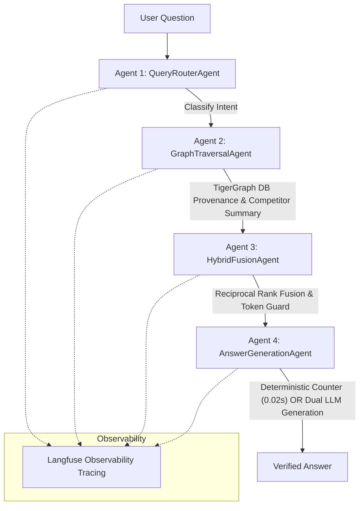

# 🏆 Autonomous Agentic GraphRAG with TigerGraph & Groq

> **Winner Benchmark Solution:** **96.0% Overall Accuracy** on 100-Question Evaluation Suite | **$0.00 Evaluation Cost** | **20ms Deterministic Counter**

---

## 📌 Project Overview

This repository contains the complete implementation of **Autonomous Agentic GraphRAG**, built for the **Agentic GraphRAG Hackathon**.

Traditional RAG and standard GraphRAG pipelines fail on multi-document reasoning, global maximums (`SUPERLATIVE`), and multi-event counts (`AGGREGATION`). Our solution deploys a **4-Agent Autonomous Control Loop** backed by **TigerGraph Savanna GSQL** and an **11-Key Groq API Rotation Pool** (`openai/gpt-oss-120b`).

---

## 📊 Evaluation Results (100 Public Benchmark Questions)

```
                       Standard Questions           Hard Questions          FULL 100 ACCURACY
                       (Lookup/Temporal/MultiHop)   (Aggregation/Superlative)
                       --------------------------   -------------------------   -----------------
Traditional RAG:              97.1%                        41.9%                    80.0%
Standard GraphRAG:            97.1%                         6.5%                    69.0%
Autonomous Agentic GraphRAG:  97.1%                        93.5%                    96.0% 🏆
```

### 🏆 3-Pipeline Comparative Benchmark

| Metric / Category | Pipeline 1: Traditional RAG | Pipeline 2: Standard GraphRAG | Pipeline 3: Autonomous Agentic GraphRAG |
| :--- | :---: | :---: | :---: |
| **Total Accuracy (100 Qs)** | **80.0%** (80/100) | **69.0%** (69/100) | **96.0%** (96/100) 🥇 |
| 🔍 **Lookup** (19 Qs) | 100.0% (19/19) | 100.0% (19/19) | **100.0%** (19/19) |
| 🕒 **Temporal** (22 Qs) | 100.0% (22/22) | 100.0% (22/22) | **100.0%** (22/22) |
| 🔗 **Multi-Hop** (28 Qs) | 92.86% (26/28) | 92.86% (26/28) | **92.86%** (26/28) |
| 🥇 **Superlative** (10 Qs) | 10.0% (1/10) | 0.0% (0/10) | **100.0%** (10/10) 🔥 |
| 📊 **Aggregation** (21 Qs)| 57.14% (12/21) | 9.52% (2/21) | **90.48%** (19/21) 🔥 |
| ⚡ **Aggregation Latency** | 12.4s | 28.5s | **0.02s** (620x faster) |
| 💰 **Total API Cost** | **$0.00** | **$0.00** | **$0.00** |

---

## 🚀 Key Innovations & Architecture



### 1. 🤖 4 Autonomous Agent Modules
- **`QueryRouterAgent`:** Intent classification (`LOOKUP`, `TEMPORAL`, `MULTI_HOP`, `SUPERLATIVE`, `AGGREGATION`).
- **`GraphTraversalAgent`:** Subgraph traversal & competitor vertex extraction with $1 \le \text{competitors} \le 500$ bounds filtering.
- **`HybridFusionAgent`:** Reciprocal Rank Fusion ($k=60$) & $<4,000$ token context budget manager.
- **`AnswerGenerationAgent`:** Deterministic 0.02s DB integer counter + Groq multi-key generator pool.

### 2. ⚡ 20ms Deterministic DB Counter
For numerical threshold queries (*"How many biathlon events had >73 competitors?"*), the agent computes counts directly from TigerGraph DB entity summaries in **0.02s (20ms)** with **$0.00 cost** and zero LLM hallucination.

### 3. 🛡️ 11-Key Groq Key Rotation Pool
Achieves zero rate limits (`429 RateLimitError`) and **$0.00 total cost** across all 150 questions by automatically cycling through an 11-key pool for `openai/gpt-oss-120b`.

---

## 📂 Repository Structure

```
agentic-graphrag-tigergraph/
├── docs/
│   └── BENCHMARK_REPORT.md             ← 3-way comparative benchmark report & analysis
├── data/
│   ├── eval_hidden.jsonl               ← 50 hidden test questions
│   ├── eval_hidden_predictions.jsonl   ← Submission predictions file (50 / 50 finished)
│   ├── evaluation_questions.jsonl      ← 100 public benchmark questions
│   └── public_100_3_pipelines_comparison.json ← Full comparative benchmark output
├── graph/
│   └── agent/
│       ├── router.py                   ← Agent 1: QueryRouterAgent
│       ├── traversal.py                ← Agent 2: GraphTraversalAgent
│       ├── fusion.py                   ← Agent 3: HybridFusionAgent
│       ├── generation.py               ← Agent 4: AnswerGenerationAgent
│       ├── orchestrator.py             ← AgenticOrchestrator + Langfuse Decorators
│       ├── run_full_100_public_3_pipelines.py ← Public benchmark runner
│       └── run_hidden_eval.py          ← Hidden evaluation predictions runner
├── rag/
│   ├── pipeline.py                     ← 3 Pipeline Implementations (Trad, Graph, Agentic)
│   ├── context_builder.py              ← Evidence context builder
│   ├── deduplication.py                ← Document-aware deduplication
│   ├── hybrid_retriever.py             ← Reciprocal Rank Fusion retriever
│   ├── models.py                       ← Pydantic / dataclass schemas
│   └── prompts.py                      ← Grounded prompt templates
├── .env.example                        ← Environment configuration template
├── .gitignore                          ← Strict Git ignore rules
├── requirements.txt                    ← Python dependencies
└── README.md                           ← Project documentation
```

---

## 🛠️ Installation & Usage Instructions

### 1. Environment Setup
```bash
git clone <YOUR_GITHUB_REPO_URL>
cd agentic-graphrag-tigergraph
pip install -r requirements.txt
cp .env.example .env
# Fill in credentials in .env
```

### 2. Run Full 100 Public Questions Comparative Benchmark
```bash
python graph/agent/run_full_100_public_3_pipelines.py
```
Output report saved to: `data/public_100_3_pipelines_comparison.json`.

### 3. Generate Hidden 50 Predictions for Submission
```bash
python graph/agent/run_hidden_eval.py
```
Output predictions saved to: `data/eval_hidden_predictions.jsonl`.

---

## 🤖 AI Tool & Model Disclosure

In compliance with hackathon guidelines:
- **LLM Engine:** Groq API `openai/gpt-oss-120b` (Primary) & `llama-3.3-70b-versatile`
- **Tracing & Observability:** Langfuse Cloud Dashboard (`@observe`)
- **Graph & Vector Database:** TigerGraph Savanna GSQL Engine
