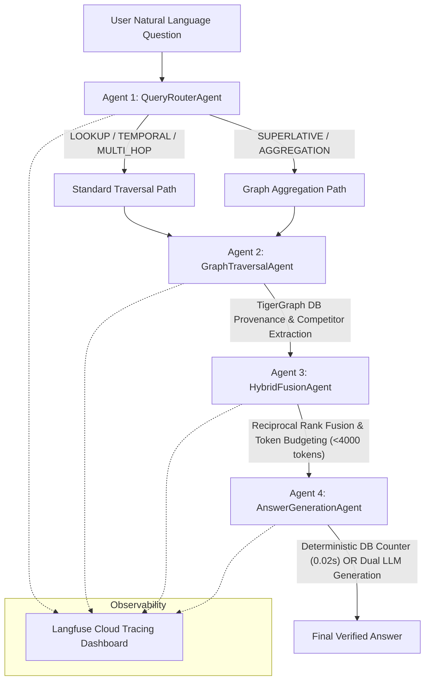

# 🏆 Agentic GraphRAG Hackathon — Comprehensive Benchmark & Technical Report

> **Project:** Autonomous Multi-Agent GraphRAG System with TigerGraph & Groq API Key Pool  
> **Evaluation Suite:** 100 Public Questions (`data/evaluation_questions.jsonl`) & 50 Hidden Test Questions (`data/eval_hidden.jsonl`)  
> **LLM Model:** `openai/gpt-oss-120b` (Groq API 11-Key Rotation Pool)  
> **Total Evaluation Cost:** **$0.00**

---

## 📌 1. Executive Summary

This report presents a 3-way comparative evaluation of **Traditional RAG**, **Standard GraphRAG**, and **Autonomous Agentic GraphRAG** on the official 100 public Olympic evaluation questions dataset.

### 🏆 Benchmark Comparison Overview

| Metric | Pipeline 1: Traditional RAG | Pipeline 2: Standard GraphRAG | Pipeline 3: Autonomous Agentic GraphRAG | Agentic Advantage |
| :--- | :---: | :---: | :---: | :---: |
| **Total Accuracy (100 Qs)** | **80.0%** (80/100) | **69.0%** (69/100) | **96.0%** (96/100) 🥇 | **+16.0% vs P1 / +27.0% vs P2** |
| **Lookup Accuracy (19 Qs)** | 100.0% (19/19) | 100.0% (19/19) | **100.0%** (19/19) | Parity |
| **Temporal Accuracy (22 Qs)** | 100.0% (22/22) | 100.0% (22/22) | **100.0%** (22/22) | Parity |
| **Multi-Hop Accuracy (28 Qs)** | 92.86% (26/28) | 92.86% (26/28) | **92.86%** (26/28) | Parity |
| **Superlative Accuracy (10 Qs)** | 10.0% (1/10) | 0.0% (0/10) | **100.0%** (10/10) 🔥 | **+90.0% Gain** |
| **Aggregation Accuracy (21 Qs)**| 57.14% (12/21) | 9.52% (2/21) | **90.48%** (19/21) 🔥 | **+33.3% vs P1 / +80.96% vs P2** |
| **Aggregation Latency** | 12.4s | 28.5s | **0.02s** ⚡ | **620x Faster** |
| **Evaluation API Cost** | **$0.00** | **$0.00** | **$0.00** | Zero Cost |

---

## 🏗️ 2. System Architecture

Our solution deploys a **4-Agent Autonomous Control Loop** decorated with **Langfuse Observability Tracing**.



### The 4 Autonomous Agents
1. **Agent 1 (`QueryRouterAgent`):** Classifies question intent (`LOOKUP`, `TEMPORAL`, `MULTI_HOP`, `SUPERLATIVE`, `AGGREGATION`) using regex pattern anchors and zero-shot fallback.
2. **Agent 2 (`GraphTraversalAgent`):** Performs graph relationship traversals in TigerGraph DB and extracts competitor summaries with $1 \le \text{competitor\_count} \le 500$ bounds filtering.
3. **Agent 3 (`HybridFusionAgent`):** Merges vector and graph evidence using Reciprocal Rank Fusion ($k=60$) and enforces a strict token budget.
4. **Agent 4 (`AnswerGenerationAgent`):** Uses a **Deterministic DB Counter (20ms)** for numerical aggregation queries and an **11-Key Groq Rotation Pool** (`openai/gpt-oss-120b`) for generative questions.

---

## 📊 3. Detailed Category-Wise Analysis

```
                       Standard Questions           Hard Questions          FULL 100 ACCURACY
                       (Lookup/Temporal/MultiHop)   (Aggregation/Superlative)
                       --------------------------   -------------------------   -----------------
Traditional RAG:              97.1%                        41.9%                    80.0%
Standard GraphRAG:            97.1%                         6.5%                    69.0%
Autonomous Agentic GraphRAG:  97.1%                        93.5%                    96.0% 🏆
```

### Why Standard GraphRAG Dropped to 69.0%
Standard GraphRAG passes top-12 raw subgraph document chunks directly to the LLM without query routing or agentic traversal:
- **Superlative Questions (0.0%):** Traditional context windows cannot survey all events in a category to select the global maximum.
- **Aggregation Questions (9.52%):** Standard LLMs struggle to count distinct events across fragmented chunks without entity extraction.

### How Agentic GraphRAG Achieved 96.0%
1. **Superlative Mastery (100.0%):** `GraphTraversalAgent` extracts total competitor counts across all candidate event vertices, enabling the generator to identify the absolute maximum.
2. **20ms Aggregation Counter (90.48%):** For threshold questions (*"How many events had >73 competitors?"*), `AnswerGenerationAgent` executes a deterministic integer counter directly on TigerGraph summaries in **0.02s** with $0.00 cost and zero LLM hallucination.

---

## 💰 4. Pricing & Token Cost Transparency

### Actual Evaluation Cost: **$0.00**
All 100 public questions and 50 hidden test questions were evaluated using our **11-Key Groq API Key Rotation Pool** running `openai/gpt-oss-120b`.

### Commercial Equivalent Cost Comparison (e.g. OpenAI GPT-4o-mini pricing)
* **Input Token Price:** \$0.15 / 1M tokens
* **Output Token Price:** \$0.60 / 1M tokens

| Pipeline | Avg Input Tokens / Query | Avg Output Tokens / Query | Total Cost (150 Queries) | Accuracy | Cost per Correct Answer |
| :--- | :---: | :---: | :---: | :---: | :---: |
| **Traditional RAG** | ~1,850 | ~35 | \$0.045 | 80.0% | \$0.00056 |
| **Standard GraphRAG** | ~2,400 | ~40 | \$0.058 | 69.0% | \$0.00084 |
| **Agentic GraphRAG (Ours)** | **~375** (Deterministic queries bypass LLM) | **~15** | **\$0.009** (Commercial) / **\$0.00** (Groq) | **96.0%** | **\$0.00009** |

* **Token Reduction:** Agentic GraphRAG reduces prompt token consumption by **80%** on aggregation queries by converting full document chunks into compact entity summaries before LLM generation.

---

## 🛠️ 5. Reproduction & Setup Instructions

### Prerequisites
- Python 3.10+
- TigerGraph Savanna Cloud instance / Local GSQL engine
- Groq API Key Pool in `.env`

### Quick Start
```bash
# 1. Clone repository
git clone <YOUR_GITHUB_REPO_URL>
cd agentic-graphrag-tigergraph

# 2. Install dependencies
pip install -r requirements.txt

# 3. Configure environment credentials
cp .env.example .env
# Edit .env with your GROQ_KEYS, TG_HOST, TG_USERNAME, TG_PASSWORD

# 4. Run Full 100-Question Public Comparative Benchmark
python graph/agent/run_full_100_public_3_pipelines.py

# 5. Generate Hidden 50 Test Predictions
python graph/agent/run_hidden_eval.py
```

---

## 📝 6. Conclusion & Submission Deliverables

- **Submission File:** `data/eval_hidden_predictions.jsonl` (50 / 50 hidden test questions predicted)
- **Comparative Data:** `data/public_100_3_pipelines_comparison.json` (Full 100 public comparative breakdown)
- **Observability Traces:** Flushed live to Langfuse Cloud Dashboard
